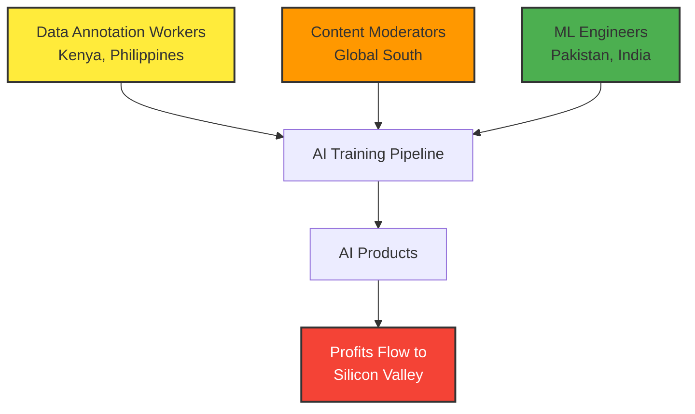

Through my work as an AI Tech Lead across startups, enterprises, and government projects spanning Pakistan, the US, Ireland, and France, I've witnessed firsthand how the current AI development paradigm creates unequal relationships between technology-producing and technology-consuming regions. This isn't an abstract critique—it's based on real observations from the ground about data flows, labor practices, and whose voices shape AI development.

Over the past seven years, I've had the privilege of working on AI projects across multiple continents—from aerospace applications in Pakistan to startup ecosystems in Ireland, from enterprise solutions in the Caribbean to design innovation in France. What I've observed isn't the democratizing force that AI advocates often promise, but a more complex reality where the benefits and burdens of AI development are unevenly distributed.

<div class="key-insight">
<strong>Key Insight:</strong> The current AI ecosystem doesn't just have bias problems—it has structural inequality problems that go far deeper than algorithmic fairness.
</div>

This post reflects on what I've learned about the global AI ecosystem and raises questions we need to address as the technology becomes more pervasive.

## The Data Extraction Reality

During my time leading data science teams at various organizations, I've seen how data flows in the global AI economy. When we built analytics frameworks for enterprise clients, the pattern was consistent: data generated in emerging markets often gets processed and monetized by platforms headquartered elsewhere<d-cite key="zuboff2019surveillance"></d-cite>.

<div class="data-flow-diagram">
Lagos User Data → Silicon Valley AI Company → Licensed Back to Lagos Banks
</div>

Take mobile financial services, an area I've worked on extensively. While innovations like M-Pesa originated in Kenya<d-cite key="hughes2007mpesa"></d-cite>, the behavioral data generated by millions of users across Africa increasingly flows to Western AI companies building credit scoring and fraud detection systems. The insights derived from this data—understanding spending patterns, predicting financial behavior, optimizing user interfaces—become intellectual property that's then licensed back to local financial institutions<d-cite key="aitken2017credit"></d-cite>.

This isn't inherently problematic, but it raises questions about value distribution. When a startup in Silicon Valley uses transaction data from Lagos to improve their algorithm, who benefits from that improvement? Usually, it's the shareholders of the Silicon Valley company, not the Lagos users whose behavior created the training data.

<d-footnote>This pattern mirrors historical resource extraction, where raw materials were shipped from colonies to metropolitan centers for processing, then sold back as finished goods.</d-footnote>

## The Invisible Workforce

Through platforms like Omdena, where I led machine learning projects for social impact, I regularly worked with data scientists and ML engineers from across the Global South. The talent and dedication were extraordinary, but the economic dynamics were troubling.



Many of the data annotation and model training tasks that make AI systems possible are outsourced to countries where labor costs are lower<d-cite key="gray2019ghost"></d-cite>. I've seen brilliant engineers in Pakistan, India, and the Philippines working on cutting-edge AI projects for a fraction of what their counterparts in Silicon Valley earn for similar work.

Content moderation—the essential but traumatic work of training AI systems to recognize harmful content—is disproportionately performed by workers in Kenya, the Philippines, and other countries where Western tech companies can hire talent cheaply<d-cite key="roberts2019behind"></d-cite>. These workers face significant psychological risks while protecting users in wealthier countries from disturbing content.

## Language and Cultural Bias in Practice

While building LLM-based solutions like **Bob-The Startup Advisor** and **Sandy-The Financial Advisor**, I encountered the limitations of current AI models firsthand. Despite claims of multilingual capability, these systems struggle with non-English contexts in ways that go beyond simple translation.

Large language models trained primarily on English text exhibit systematic biases when dealing with non-Western concepts<d-cite key="bender2021stochastic"></d-cite>. When I tested financial advisory models with questions about Islamic banking principles or traditional business practices common in South Asian markets, the responses were often inadequate or culturally inappropriate.


When I asked my financial advisor LLM about *hawala* (traditional Islamic money transfer), it provided generic responses about "informal banking" without understanding the cultural and religious principles that make hawala a legitimate and important financial instrument in many communities.


This isn't just a technical limitation—it reflects whose knowledge and perspectives are valued in AI training data. The vast majority of text used to train large language models comes from English-language sources, primarily from Western contexts<d-cite key="rogers2020embedding"></d-cite>. Local knowledge systems, indigenous practices, and non-Western ways of organizing information are systematically underrepresented.

## The Innovation Periphery

One of the most frustrating aspects of the current AI ecosystem is how innovation is perceived and valued. During my MBA at Rennes School of Business, I studied how technological innovation is often framed as flowing from "centers" (Silicon Valley, Boston, London) to "peripheries" (everywhere else).

```chartjs
{
  "type": "pie",
  "data": {
    "labels": ["North America", "Europe", "East Asia", "Rest of Asia", "Africa", "Latin America"],
    "datasets": [
      {
        "label": "AI Investment Distribution (%)",
        "data": [45, 25, 20, 7, 2, 1],
        "backgroundColor": [
          "#FF6384",
          "#36A2EB", 
          "#FFCE56",
          "#4BC0C0",
          "#9966FF",
          "#FF9F40"
        ]
      }
    ]
  },
  "options": {
    "responsive": true,
    "plugins": {
      "title": {
        "display": true,
        "text": "Global AI Investment Distribution"
      },
      "legend": {
        "position": "bottom"
      }
    }
  }
}
```

This framing ignores the reality I've witnessed: incredible innovation happening across the Global South, often out of necessity rather than venture capital abundance. The aerospace projects I worked on in Pakistan involved sophisticated optimization algorithms developed under resource constraints that would be unimaginable in Western tech companies.

Yet these innovations rarely receive global recognition or investment. The AI research emerging from universities in Nigeria, Pakistan, Brazil, or India is often overlooked by major conferences and journals, which maintain editorial boards dominated by Western institutions<d-cite key="mohamed2020decolonising"></d-cite>.

## A More Nuanced Path Forward

I'm not arguing that all AI development should be localized or that global collaboration is inherently problematic. The projects I've worked on have benefited enormously from international collaboration and knowledge sharing.

But we need more honest conversations about power dynamics in AI development. Some concrete steps that could help:

1. **Equitable Partnership Models**: When AI companies use data from emerging markets, they should share the value created, not just extract insights<d-cite key="mcdonald2021corporate"></d-cite>.

2. **Diverse Training Data**: Deliberate efforts to include non-Western knowledge sources in AI training data, with proper compensation and attribution to source communities<d-cite key="blodgett2020language"></d-cite>.

3. **Local AI Capacity Building**: Investment in AI research institutions and startups in the Global South, not just outsourcing implementation work<d-cite key="adams2021decolonized"></d-cite>.

4. **Ethical Labor Practices**: Fair compensation and psychological support for workers performing essential but difficult AI training tasks<d-cite key="gillespie2018custodians"></d-cite>.

```chartjs
{
  "type": "bar",
  "data": {
    "labels": ["Current Model", "Proposed Model"],
    "datasets": [
      {
        "label": "Silicon Valley",
        "data": [70, 40],
        "backgroundColor": "#FF6384"
      },
      {
        "label": "Global South", 
        "data": [10, 35],
        "backgroundColor": "#36A2EB"
      },
      {
        "label": "Europe",
        "data": [20, 25], 
        "backgroundColor": "#FFCE56"
      }
    ]
  },
  "options": {
    "responsive": true,
    "plugins": {
      "title": {
        "display": true,
        "text": "Current vs. Proposed AI Value Distribution"
      },
      "legend": {
        "position": "top"
      }
    },
    "scales": {
      "y": {
        "beginAtZero": true,
        "max": 100,
        "title": {
          "display": true,
          "text": "Percentage of Value (%)"
        }
      }
    }
  }
}
```

## Questions for the AI Community

As someone who has worked across this ecosystem, I'm left with questions that the AI community needs to address:

- How do we ensure that AI development serves local needs rather than just global markets?
- What does equitable participation in the AI economy actually look like?
- How can we preserve cultural diversity while benefiting from AI's connective potential?
- Who should have control over AI systems that affect millions of people?

These aren't abstract philosophical questions—they're practical challenges that will determine whether AI becomes a force for reducing or increasing global inequality.

The technology itself is remarkable. I've seen AI systems optimize supply chains, predict equipment failures, and automate routine tasks in ways that genuinely improve people's lives. But technology alone doesn't determine outcomes—the economic and social structures around it do.

As AI practitioners, we have a responsibility to think critically about these structures and work toward more equitable alternatives. The future of AI isn't predetermined, but it won't democratize itself.

<div class="author-bio">
<strong>About the Author:</strong> Danial Amin is an AI Tech Lead currently working on generative AI solutions for design optimization at Samsung Design Innovation Center in France. He has led AI projects across multiple continents and holds advanced degrees in both technical and business domains. You can connect with him on <a href="https://linkedin.com/in/danial-amin">LinkedIn</a> or view his technical work on <a href="https://github.com/danial-amin">GitHub</a>.
</div>

---

*What do you think? Have you experienced similar patterns in your work with AI systems? Share your thoughts in the comments below.*

---

## References

<d-bibliography src="2025-03-15-ai-global-inequality.bib"></d-bibliography>


```bibtex
@book{zuboff2019surveillance,
  title={The Age of Surveillance Capitalism: The Fight for a Human Future at the New Frontier of Power},
  author={Zuboff, Shoshana},
  year={2019},
  publisher={PublicAffairs}
}

@article{hughes2007mpesa,
  title={M-PESA: mobile money for the "unbanked" turning cellphones into 24-hour tellers in Kenya},
  author={Hughes, Nick and Lonie, Susie},
  journal={Innovations},
  volume={2},
  number={1-2},
  pages={63--81},
  year={2007},
  publisher={MIT Press}
}

@article{aitken2017credit,
  title={'All data is credit data': Constituting the unbanked},
  author={Aitken, Rob},
  journal={Competition \& Change},
  volume={21},
  number={4},
  pages={274--300},
  year={2017},
  publisher={SAGE Publications}
}

@book{gray2019ghost,
  title={Ghost Work: How to Stop Silicon Valley from Building a New Global Underclass},
  author={Gray, Mary L and Suri, Siddharth},
  year={2019},
  publisher={Houghton Mifflin Harcourt}
}

@book{roberts2019behind,
  title={Behind the Screen: Content Moderation in the Shadows of Social Media},
  author={Roberts, Sarah T},
  year={2019},
  publisher={Yale University Press}
}

@inproceedings{bender2021stochastic,
  title={On the dangers of stochastic parrots: Can language models be too big?},
  author={Bender, Emily M and Gebru, Timnit and McMillan-Major, Angelina and Shmitchell, Shmargaret},
  booktitle={Proceedings of the 2021 ACM conference on fairness, accountability, and transparency},
  pages={610--623},
  year={2021}
}

@inproceedings{rogers2020embedding,
  title={What's in your embedding? Analyzing word embedding bias in conceptual spaces},
  author={Rogers, Anna and Kovaleva, Olga and Downey, Matthew and Rumshisky, Anna},
  booktitle={Proceedings of the 1st Workshop on Gender Bias in Natural Language Processing},
  pages={1--16},
  year={2020}
}

@article{mohamed2020decolonising,
  title={Decolonising science--reconstructing relations},
  author={Mohamed, Shakir and Png, Marie-Therese and Isaac, William},
  journal={eLife},
  volume={9},
  pages={e65546},
  year={2020},
  publisher={eLife Sciences Publications Limited}
}

@article{mcdonald2021corporate,
  title={Corporate power and global health governance: The example of foundation and pharmaceutical industry relations},
  author={McDonald, Sean and Milne, Richard},
  journal={Global Social Policy},
  volume={21},
  number={2},
  pages={275--297},
  year={2021},
  publisher={SAGE Publications}
}

@inproceedings{blodgett2020language,
  title={Language (technology) is power: A critical survey of "bias" in NLP},
  author={Blodgett, Su Lin and Barocas, Solon and Daum{\'e} III, Hal and Wallach, Hanna},
  booktitle={Proceedings of the 58th Annual Meeting of the Association for Computational Linguistics},
  pages={5454--5476},
  year={2020}
}

@article{adams2021decolonized,
  title={Can artificial intelligence be decolonized?},
  author={Adams, Rachel},
  journal={Interdisciplinary Science Reviews},
  volume={46},
  number={1-2},
  pages={176--197},
  year={2021},
  publisher={Taylor \& Francis}
}

@book{gillespie2018custodians,
  title={Custodians of the Internet: Platforms, Content Moderation, and the Hidden Decisions That Shape Social Media},
  author={Gillespie, Tarleton},
  year={2018},
  publisher={Yale University Press}
}
```

